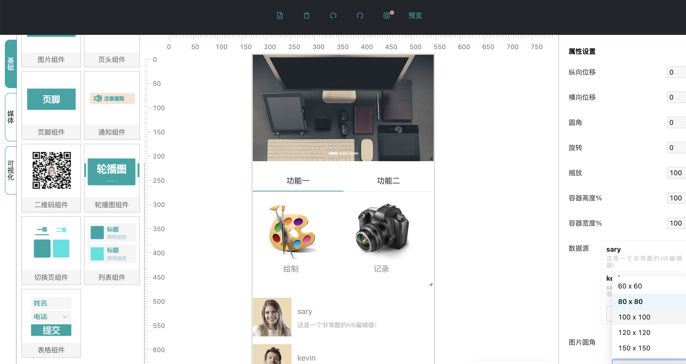

# Nuwa 编辑器

Nuwa 编辑器是一款专门为非开发人员及运营人员打造的一款可视化可拖拽的编辑器。使用它可以生产出，企业所需要的落地页、h5 页面、可视化界面。
使用 vue3.0+ ts + jsx 开发

### 启动项目

```
git clone https://github.com/suyuhuan/nuwa-vue.git
cd nuwa-vue
npm install
npm run serve
```

### 技术栈

- vue3.0
- typescript
- jsx

### 初始化项目

这里直接通过 vue 官方的脚手架进行环境配置
npm install -g @vue/cli
vue create nuwa

##### 对 nuwa 配置环境

第一步：选择 Manually Select features
第二步： 选择 choose vue version、Babel、TypeScript、Router、vuex、css-pre- processors、linter/formatter、 unit-testing
第三步：选择 3.0。yes。yes。yes
第四步：选择 less
第 5 步：aslant + prettier
第 6 步：全部选择
第 7 步 jest
第 8 步 in dedicated config files

### 项目 vue3.0 + jsx 开发环境

##### 1.配置 Vscode 安装 prettier

新建.vscode 文件夹，在文件夹中 新建 settings.json
在文件中输入

```js
{
    "editor.formatOnSave": true
}
```

##### 2.新建.prettierrc 代码检查

```js
 输入
  {
    "semi":false,
    "singleQuote": true,
    "arrowParens": "always",
    "trailingComma":"all"
 }
```

##### 3.安装 @vue/babel-plugin-jsx

```js
 mpm install  @vue/babel-plugin-jsx  —save-dev
```

```js
配置babel.config.js
module.exports = {
  plugins: ['@vue/babel-plugin-jsx'],
}
```

##### 4.进行测试

把 app.vue 改为 app.tsx
在 app 中输入

```js
import { defineComponent } from 'vue'
const App = defineComponent({
  setup() {
    return () => {
      return <div>hello world</div>
    }
  },
})

export default App
```

### 效果图如下


